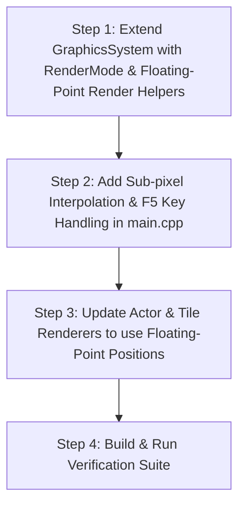

# Implementation Plan: Enhanced Smooth Renderer with F5 Hotkey Toggle

## Overview
This implementation plan details how to add an **Enhanced Smooth Renderer** to the *Captain Comic* refactor while preserving the authentic 1989 **Classic EGA Renderer**. The user can toggle between the two rendering modes at any time during gameplay by pressing **`F5`**.

---

## 1. Technical Goals & Architecture

1. **Dual Render Modes**:
   - **`Classic` (EGA 1989)**: Integer camera positioning, discrete 16x16 tile blitting, exact historical tile snapping.
   - **`Enhanced Smooth`**: Sub-pixel camera positioning, fixed-timestep physics + render interpolation, floating-point destination rectangle rendering (`SDL_RenderCopyF` / `SDL_FRect`), and smooth sub-pixel sprite blitting.
2. **Runtime Hotkey (`F5`)**:
   - Toggle instantly between `Classic` and `Enhanced Smooth` without resetting game state.
   - Show a subtle non-intrusive HUD message or debug text feedback on mode toggle (e.g. `Render Mode: Enhanced Smooth` / `Render Mode: Classic`).
3. **Preserve Legacy Logic**:
   - The authoritative game state (`comic_x`, `camera_x`, physics ticks) remains completely unchanged for physics/collision logic so game behavior is 100% accurate.

---

## 2. Proposed Changes

### Module 1: `include/graphics.h` & `src/graphics.cpp`
- **Render Mode Enum**:
  ```cpp
  enum class RenderMode { Classic, EnhancedSmooth };
  ```
- **State in `GraphicsSystem`**:
  - Add `RenderMode current_render_mode = RenderMode::Classic;`
  - Add helper functions: `void toggle_render_mode()`, `RenderMode get_render_mode() const`, `void set_render_mode(RenderMode mode)`.
  - Add floating-point render helper methods:
    - `render_tile_f(float screen_x, float screen_y, Tileset* tileset, uint8_t tile_id, float scale)`
    - `render_sprite_f(float screen_x, float screen_y, const Sprite& sprite, float width, float height, bool flip_h = false)`
    - `render_sprite_centered_scaled_f(float screen_x, float screen_y, const Sprite& sprite, float width, float height, bool flip_h = false)`

### Module 2: Sub-pixel Camera & Interpolation Logic (`src/main.cpp`)
- **Render State Variables**:
  - Maintain previous frame camera position (`prev_camera_x`) and current frame camera position (`curr_camera_x`).
  - Calculate interpolation factor $\alpha = \frac{\text{accumulated\_ms}}{\text{MS\_PER\_TICK}}$ (clamped to $[0.0, 1.0]$).
  - Compute interpolated camera coordinate for rendering:
    ```cpp
    float render_camera_x = (render_mode == RenderMode::EnhancedSmooth)
        ? (prev_camera_x * (1.0f - alpha) + camera_x * alpha)
        : static_cast<float>(camera_x);
    ```
- **Interpolated Player Position**:
  - Compute `render_comic_x = prev_comic_x * (1.0f - alpha) + comic_x * alpha;`

### Module 3: Input Handling for `F5` Hotkey (`src/main.cpp`)
- In `SDL_KEYDOWN` event handling:
  ```cpp
  case SDLK_F5:
      g_graphics->toggle_render_mode();
      std::cout << "Render mode toggled to: "
                << (g_graphics->get_render_mode() == GraphicsSystem::RenderMode::EnhancedSmooth ? "Enhanced Smooth" : "Classic")
                << std::endl;
      break;
  ```

### Module 4: Actor Rendering Updates (`include/actors.h` & `src/actors.cpp`)
- Update `ActorSystem::render_*` functions to support floating-point camera positions `render_camera_x` when in Enhanced Smooth mode.

---

## 3. Step-by-Step Implementation Strategy



1. **Step 1**: Add `RenderMode` enum, toggle methods, and floating-point rendering primitives (`render_tile_f`, `render_sprite_centered_scaled_f`) using `SDL_RenderCopyF` / `SDL_FRect` in `GraphicsSystem`.
2. **Step 2**: Wire `F5` key press in `main.cpp` event loop to trigger `toggle_render_mode()`. Add render mode status display to debug overlay.
3. **Step 3**: Implement physics-to-render frame interpolation ($\alpha$) in the main loop so camera and player movement are smooth on high refresh rate monitors.
4. **Step 4**: Run CTest / build targets to ensure existing tests pass and verify rendering accuracy in both modes.

---

## 4. Verification Plan

### Automated Tests
- Run full test suite: `ctest --test-dir build --output-on-failure`
- Ensure no unit tests broken.

### Interactive Runtime Manual Verification
- Launch game executable: `./build/captain_comic`
- Walk left and right while observing scroll behavior in **Classic Mode** (default).
- Press **`F5`** during gameplay: confirm HUD/terminal logs `Render Mode: Enhanced Smooth`.
- Observe sub-pixel scrolling smoothness when moving across tile boundaries.
- Press **`F5`** again: confirm seamless switch back to Classic mode without glitching.
